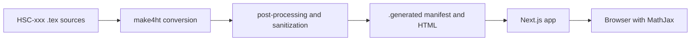
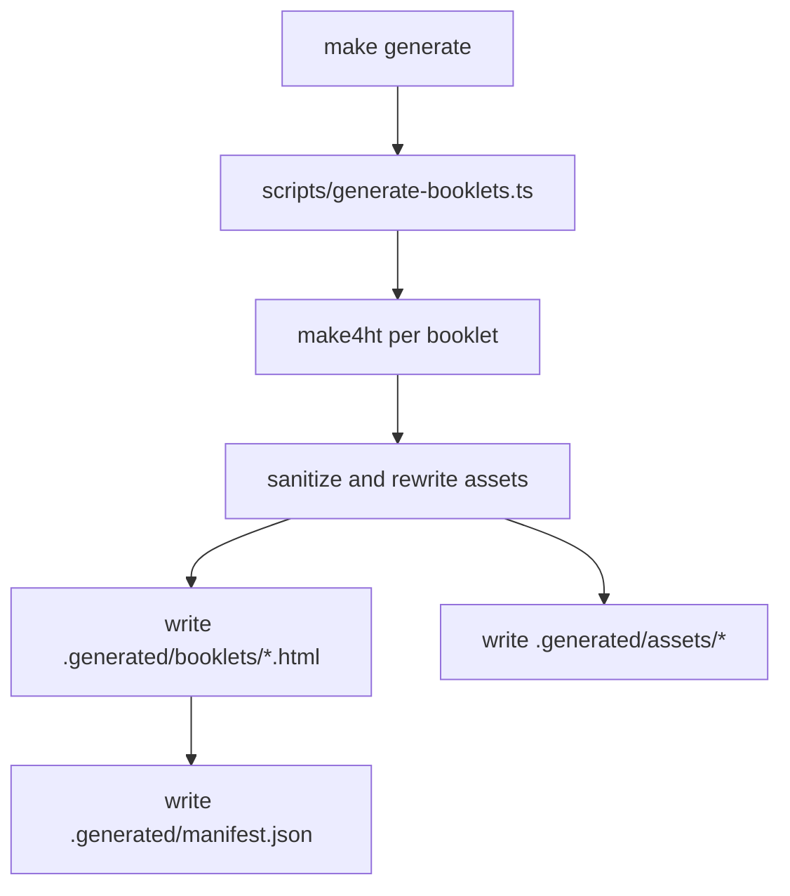
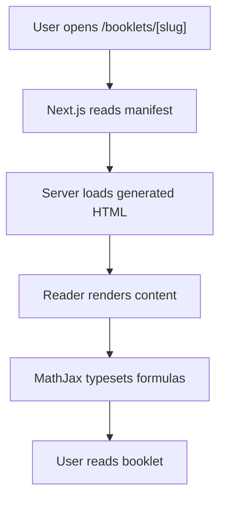

# System Architecture

`HSC-Viewer-MathJax` converts sibling `HSC-xxx` LaTeX projects into generated HTML, then serves that output with Next.js.

## System context

## Conversion pipeline

## Runtime flow

