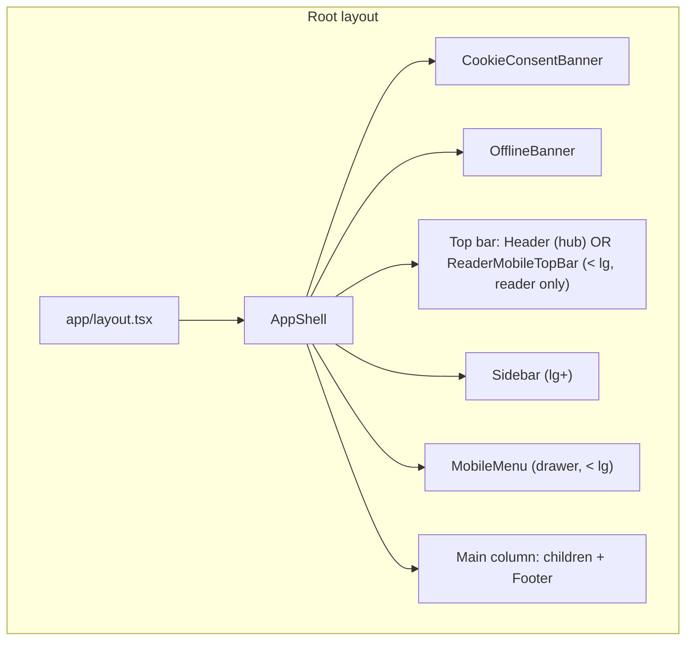
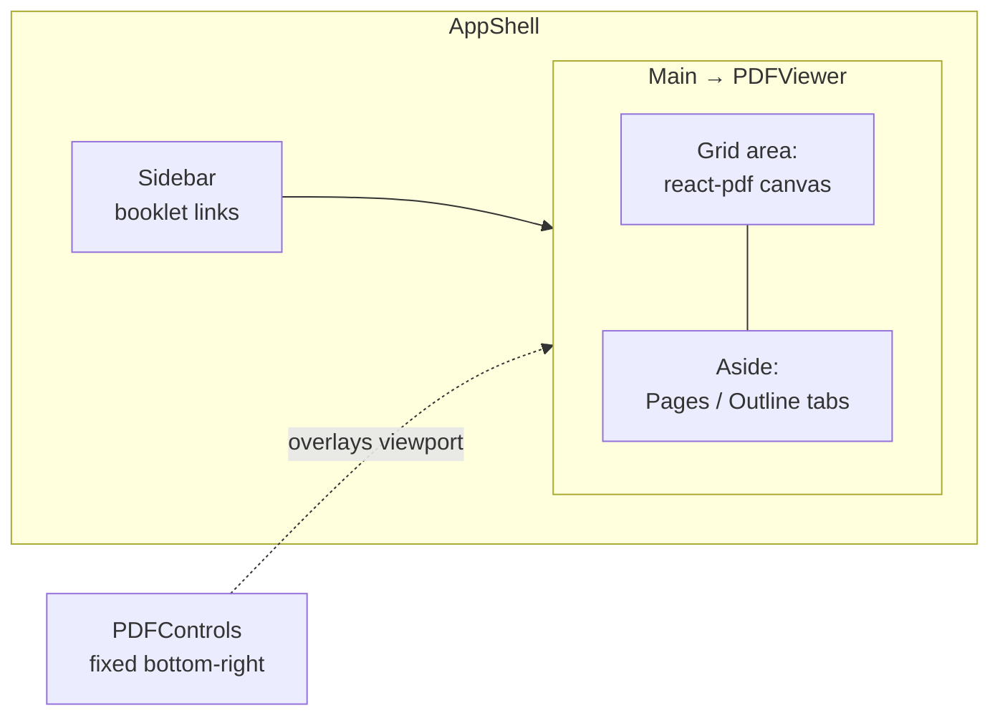
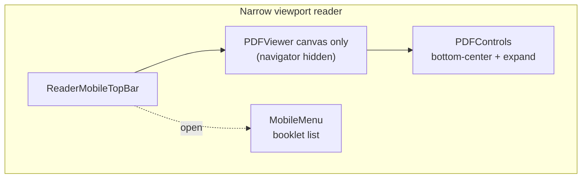

# Main hub & reader — frontend architecture

This document maps how the [HSC Math Hub](https://hsc-math-hub.vercel.app/) frontend is composed at the **site shell** level and, for reading, the **four-region booklet layout** you see after opening a title (for example `/booklets/hsc-trigonometry/1`).

**Terminology**

- **Hub home** — route `/`, the marketing blurb plus the booklet grid. Implemented by `app/page.tsx` → `GridView`.
- **Booklet reader** — routes `/booklets/[slug]` and `/booklets/[slug]/[page]`, the in-browser PDF experience with sidebar, canvas, navigator, and floating controls. Implemented by `PDFViewer` (client).

The URL you land on first is the hub; the **desktop layout with booklet menu + PDF + outline + controller** is the reader, not the home grid.

---

## Global application shell

Every route is wrapped by `app/layout.tsx` → `AppShell`. The shell provides sticky booklet navigation (desktop sidebar or mobile drawer), route-aware top bars, global banners, and the main content column.



**Responsive rule:** On large viewports (`lg` and up), `Sidebar` is a fixed-width purple rail listing all booklets. Below that breakpoint the same links live in `MobileMenu`, opened from the header (hub) or `ReaderMobileTopBar` (reader).

---

## Hub home (`/`)

Single-purpose page: hero copy and a responsive grid of `ThumbnailCard` components backed by `BOOKLETS` in `lib/booklets.ts`.

```text
+--------------------------------------------------+
| AppShell: Header (title, menu button on mobile)  |
+----------+---------------------------------------+
| Sidebar  |  GridView                             |
| (lg+)    |  - hero                               |
|          |  - grid: ThumbnailCard × N            |
|          |  - optional "Coming soon" section     |
+----------+---------------------------------------+
|                      Footer                       |
+--------------------------------------------------+
```

*On narrow screens the left column is replaced by the slide-in `MobileMenu`.*

---

## Booklet reader — desktop layout (`lg+`)

Inside `PDFViewer`, the **reading stage** is a rounded card. A two-column grid places the PDF canvas on the left and the **Pages / Outline** navigator on the right (`sticky`, ~260px). **PDFControls** is a separate **fixed** panel anchored to the **bottom-right** on desktop (`components/ui/PDFControls.tsx`).

The booklet list remains in `AppShell`’s `Sidebar` (or the mobile drawer).

```text
  AppShell (outer)
  +------------------+----------------------------------------+------------------+
  | Sidebar          |  PDFViewer (inner card)                                     |
  | (booklet menu)   |  +-----------------------------+------------------------+ |
  |                  |  | PDF stage (react-pdf        | Pages / Outline        | |
  |                  |  | Document + Page(s))         | navigator (sticky)     | |
  |                  |  +-----------------------------+------------------------+ |
  +------------------+----------------------------------------+------------------+
                                              [ PDFControls: fixed bottom-right ]
                                                     (share, theme, zoom, …)
```



**Optional persistence:** If the user has dragged the navigator, it can be positioned with `position: fixed` and coordinates restored from cookies (`PREF_KEYS.navPanelPos`), so it may float separately from the sticky column behavior.

---

## Booklet reader — mobile / tablet (`< lg`)

Layout and feature exposure change in several concrete ways (see `tests/e2e/responsive.spec.ts` and `mobile-reader.spec.ts`):

| Area | Desktop (`lg+`) | Mobile / tablet (`< lg`) |
|------|-----------------|---------------------------|
| Booklet menu | `Sidebar` rail | `MobileMenu` drawer (`ReaderMobileTopBar` → “Open booklet navigation”) |
| Top chrome | Hub: `Header`. Reader: **no** top bar (`ReaderMobileTopBar` is `lg:hidden`). | Reader: sticky `ReaderMobileTopBar` (menu, title, home). Hub: `Header`. |
| Pages / Outline panel | Visible `aside` with tabs | **Hidden** — `getByLabel("PDF navigation sidebar")` is not visible (see `tests/e2e/responsive.spec.ts`). |
| `PDFControls` | Fixed **bottom-right** card (~260px) | Fixed **bottom-center** bar; primary actions visible, “Show viewer tools” reveals share and extended tools |

```text
  Mobile reader (conceptual)

  +--------------------------------+
  | ReaderMobileTopBar (menu, home)|
  +--------------------------------+
  |                                |
  |   PDF canvas (full width)      |
  |                                |
  +--------------------------------+
  | [ compact PDFControls strip ]  |  <- bottom, centered; expandable
  +--------------------------------+

  Booklet list: off-canvas left (MobileMenu)
```



---

## Component → file map (reader-focused)

| UI region | Primary component | File |
|-----------|-------------------|------|
| Global shell | `AppShell` | `components/layout/AppShell.tsx` |
| Hub grid | `GridView` | `components/pages/GridView.tsx` |
| Booklet cards | `ThumbnailCard` | `components/ui/ThumbnailCard.tsx` |
| PDF + outline + layout orchestration | `PDFViewer` | `components/pages/PDFViewer.tsx` |
| Floating toolbar | `PDFControls` | `components/ui/PDFControls.tsx` |
| Desktop booklet rail | `Sidebar` | `components/layout/Sidebar.tsx` |
| Mobile booklet drawer | `MobileMenu` | `components/layout/MobileMenu.tsx` |
| Reader top bar (mobile-first) | `ReaderMobileTopBar` | `components/layout/ReaderMobileTopBar.tsx` |
| Hub top bar | `Header` | `components/layout/Header.tsx` |

---

## Related docs

- [docs/architecture.md](architecture.md) — data flow, static generation, PDF constraints
- [docs/agents/architecture.md](agents/architecture.md) — agent-oriented component responsibilities
