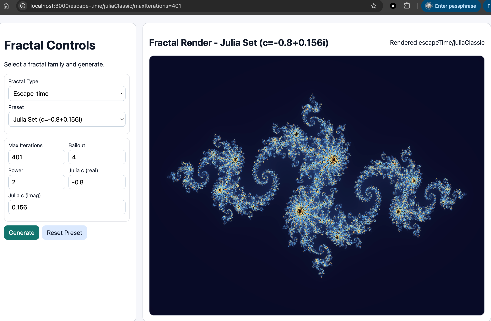

# Fractals Generator

TypeScript fractal engine + Next.js web app.

This repository now supports two products:

- a publishable npm package (`IFS`, `LSystem`) from `src/`
- a Vercel-ready Next.js web app with six fractal families

## Demo & Screenshot

[Julia set](http://localhost:3000/escape-time/juliaClassic/maxIterations=401)

---



## Fractal Families

- `ifs`
- `lsystem`
- `escapeTime`
- `newton`
- `attractor`
- `inversion`

## Local Development

Install dependencies:

```bash
npm install
```

Run Next.js app:

```bash
npm run dev
```

Open:

```text
http://127.0.0.1:3000
```

## Build Targets

Build package outputs:

```bash
npm run build
```

Build web app:

```bash
npm run build:web
```

Run production web app:

```bash
npm run start
```

## Package Usage

```ts
import { IFS, LSystem } from 'fractals';
```

Library outputs:

- `lib/` CommonJS + declarations
- `esm/` ESM build

## Script Automation

- `npm run test:fractals:playwright`:
  - starts Next.js dev server
  - tests all fractal type + preset combinations in UI
  - writes artifacts to `artifacts-playwright/`

- `node scripts/generate-all-fractals.js`:
  - generates catalog images to `artifacts/`
  - writes summary `artifacts/index.json`

- `npm run export:tex` (see [docs/CLI.md](docs/CLI.md)):
  - exports TikZ (`.tikz`) and/or standalone LaTeX (`.tex`) for presets
  - default mode: one preset per fractal family; advanced flags select families, presets, colors, and extra params

## TeX / TikZ export

- **Web UI**: use the viewer overlay buttons to download a **TikZ snippet** (`.tikz`) or a **standalone** LaTeX document (`.tex`). Current form settings are sent as query parameters.
- **HTTP API** (`GET /api/v1/[family]/[preset]`):
  - `format=png` (default) — PNG image
  - `format=tikz` — TikZ `tikzpicture` fragment (`text/plain`, attachment `.tikz`)
  - `format=tex` — full standalone compilable document (`text/plain`, attachment `.tex`)
  - Optional: `texMaxDim=<px>` caps internal raster size for escape-time, Newton, attractor, and inversion exports (IFS / L-system use vector TikZ).
  - Other query params match the existing PNG endpoint (`width`, `height`, `mainColorScheme`, `backgroundColor`, and fractal-specific overrides).

## Documentation

- `docs/architecture.md`
- `docs/techstack.md`
- `docs/use-cases.md`
- `docs/fractals.md`
- `docs/CLI.md`

## License 

- This project reuses the exiting `fractals` package. However, it will be migrated to a new package with different architecture
- See `LICENSE.md` the the license of the Next.js renderer. 