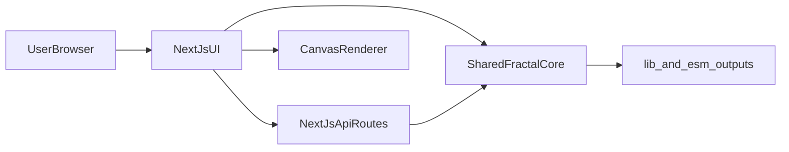

# Architecture

This project runs as a dual-target system:

- publishable fractal package
- Next.js web application
- Tech stack details: see `docs/techstack.md`
- Fractal applications: see `docs/use-cases.md`
- Getting started: see `README.md` and `QUICKSTART.md`

## Modules

- `src/`: package core (`IFS`, `LSystem`, types)
- `app/`: Next.js UI and API routes
- `scripts/`: artifact generation + Playwright sweep
- `docs/`: architecture, stack, use-cases, math notes

## API Contract

- `POST /api/render`
  - request: family + preset + params + width/height
  - response: image pixel array + render metadata

## Boundaries

- Keep package logic reusable and independent of Next.js runtime details.
- Keep web UI focused on orchestration and rendering controls.
- Keep script automation stable for regression artifacts.
