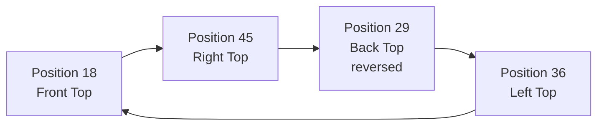
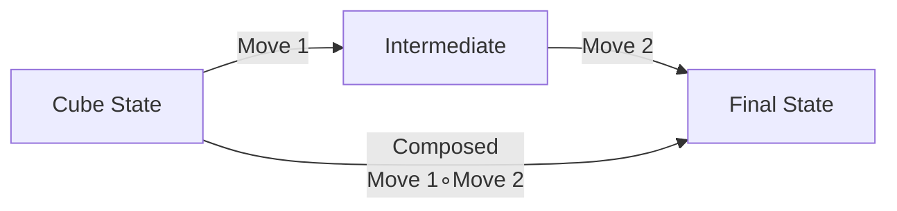
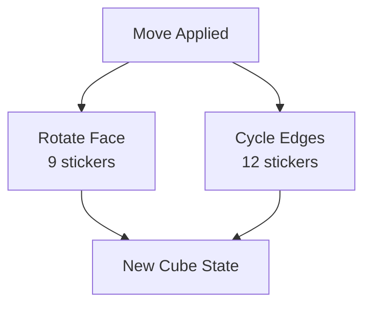
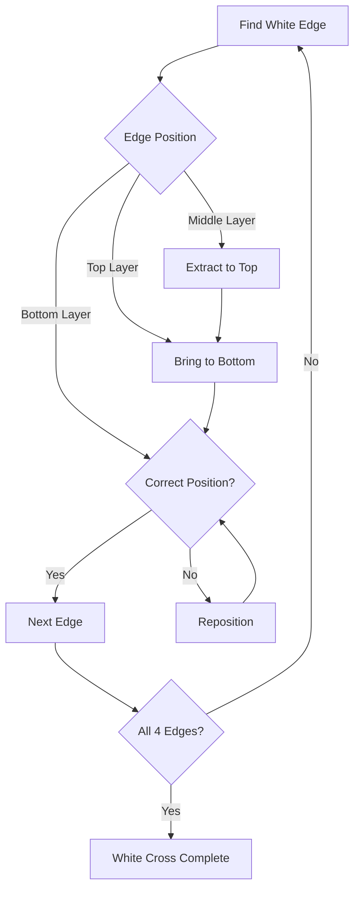
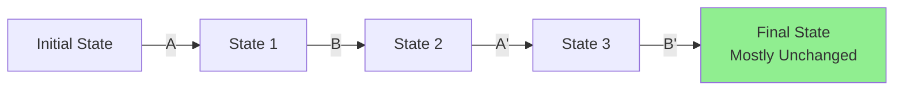

# Algorithms and Group Theory

This document explains the mathematical foundations and algorithms used in the Rubik's Cube Group Theory Solver.

## Group Theory Concepts

### Permutations

A Rubik's Cube can be represented as a permutation group. Each of the 54 stickers has a position, and moves are permutations that rearrange these positions.

#### Sticker Indexing

The cube has 54 stickers (6 faces × 9 stickers each), indexed from 0 to 53:

```
Face 0 (Top):      Face 1 (Bottom):   Face 2 (Front):
0  1  2            9  10 11           18 19 20
3  4  5            12 13 14           21 22 23
6  7  8            15 16 17           24 25 26

Face 3 (Back):     Face 4 (Left):      Face 5 (Right):
27 28 29           36 37 38            45 46 47
30 31 32           39 40 41            48 49 50
33 34 35           42 43 44            51 52 53
```

#### Permutation Representation

A permutation `p` is a function where `p[i] = j` means "the sticker at position `i` moves to position `j`".

For example, the U move rotates the top face and cycles the top rows of adjacent faces:



### Cycle Notation

Moves can be represented using cycle notation. For instance, the U move includes:

- **Face rotation**: (0 2 8 6)(1 5 7 3) - corners and edges of top face
- **Edge cycle**: (18 45 29 36)(19 46 28 37)(20 47 27 38) - top rows of adjacent faces

### Permutation Composition

Applying multiple moves is equivalent to composing their permutations:



### Inverse Permutations

Every move has an inverse. For example:
- `U'` is the inverse of `U`
- `U ∘ U' = identity` (no change)

## Move Implementation

### Basic Moves

The 12 basic moves are:

| Move | Description | Stickers Affected |
|------|-------------|-------------------|
| U | Top face clockwise | 21 stickers (9 face + 12 edges) |
| U' | Top face counter-clockwise | Inverse of U |
| D | Bottom face clockwise | 21 stickers |
| D' | Bottom face counter-clockwise | Inverse of D |
| R | Right face clockwise | 21 stickers |
| R' | Right face counter-clockwise | Inverse of R |
| L | Left face clockwise | 21 stickers |
| L' | Left face counter-clockwise | Inverse of L |
| F | Front face clockwise | 21 stickers |
| F' | Front face counter-clockwise | Inverse of F |
| B | Back face clockwise | 21 stickers |
| B' | Back face counter-clockwise | Inverse of B |

### Move Structure

Each move consists of:

1. **Face rotation**: 9 stickers on the rotated face
2. **Edge cycling**: 12 stickers on adjacent faces' edges



## Solver Algorithm: Beginner's Method

The beginner's method solves the cube layer-by-layer in 6 steps:

### Step 1: White Cross

Position and orient the 4 white edge pieces on the bottom face.



### Step 2: White Corners

Place the 4 white corner pieces in correct positions on the bottom layer.

### Step 3: Middle Layer Edges

Solve the 4 middle layer edge pieces.

### Step 4: Yellow Cross

Create a yellow cross on the top face (orientation step).

**Algorithm**: F R U R' U' F'

This algorithm creates or improves the yellow cross pattern.

### Step 5: Orient Yellow Corners

Orient all yellow corners correctly (may require multiple applications).

### Step 6: Permute Yellow Corners

Position yellow corners in their final locations.

## Commutator Operations

Commutators are sequences of the form `A B A' B'` where:
- `A` and `B` are move sequences
- `A'` and `B'` are their inverses



Commutators are useful because they:
- Affect only a small subset of pieces
- Leave most of the cube unchanged
- Allow precise control for solving specific cases

## Cube State Representation

### Internal Representation

The cube state is stored as a list of 54 characters:
- Each index represents a sticker position
- Each value represents the color at that position

### Face-Based Interface

For compatibility, the cube also provides a face-based interface:
- `get_face(face_name)` returns a 3×3 array
- `set_face(face_name, face_data)` sets a face from a 3×3 array

### State Validation

The `is_solved()` method checks if all faces have uniform colors:
- Each face's 9 stickers must all be the same color
- All 6 faces must be correctly colored

## Performance Considerations

### Permutation Application

Applying a permutation is O(54) = O(1) since there are always 54 stickers.

### Solver Complexity

The beginner's method typically requires:
- **Move count**: 50-100 moves for a full solve
- **Time complexity**: O(n) where n is the number of moves
- **Space complexity**: O(1) for the cube state

### Optimization Opportunities

Future enhancements could include:
- Move sequence optimization (reducing move count)
- Pattern recognition for faster solving
- Advanced algorithms (CFOP, Roux, etc.)

## Further Reading

- Group theory and permutation groups
- Rubik's Cube solving algorithms
- Cayley graphs and planar representations
- Computational group theory
